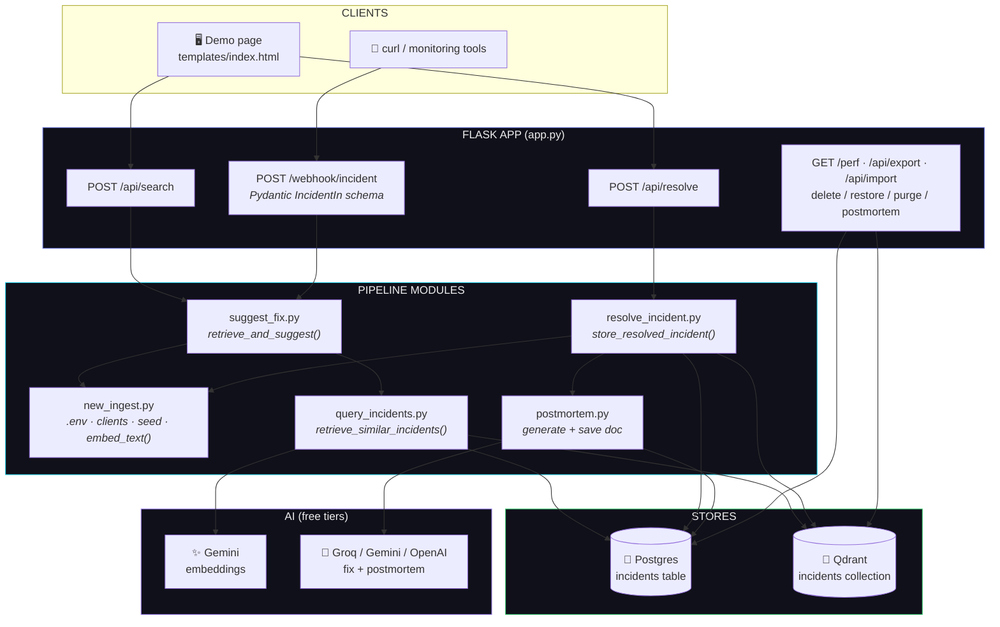
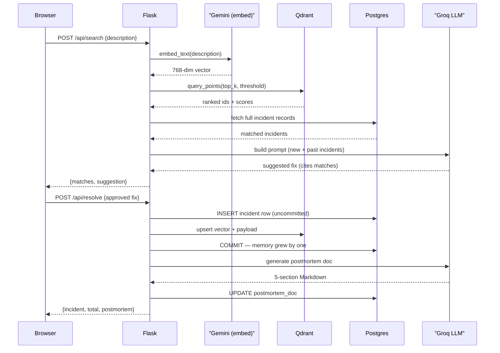

<div align="center">
  
<p align="center">
  
</p>


<p align="center">
  
</p>

-F55036?style=for-the-badge)

</div>


## 🧠 The idea: memory that compounds

Most incident systems treat every alert as a brand-new mystery. **Incident Memory** doesn't. It keeps every incident you've ever resolved — the root cause, the fix, the postmortem — as *searchable knowledge*, and uses it to answer the next one.

The loop is the whole point:

<!-- animated pipeline diagram -->
<p align="left">
  
</p>

1. **A new incident arrives** — typed into the demo page or pushed via webhook
2. **It is embedded** into a vector with Gemini `gemini-embedding-001` (768 dims)
3. **Similar past incidents are retrieved** from Qdrant (cosine similarity) and enriched with their full Postgres records
4. **An LLM (Groq, free tier) suggests a fix** that *cites* the matched past incidents and why they match
5. **The engineer edits / approves the fix** and marks it resolved
6. **It is written back to memory** (Postgres row + Qdrant vector) — and a full postmortem document is auto-generated onto the same row

Next time something similar happens, the system has *one more* piece of hard-won knowledge to draw from. **The memory grew by one. It compounds.**

> 💡 This project was built for a hackathon — it runs entirely on **free tiers** (Groq + Gemini, no credit card required) and demonstrates the full loop live in a browser.

---

## 🔄 How it works

```mermaid
flowchart LR
    A["🚨 New incident<br/>(UI search box or webhook)"] --> B["1 · Embed<br/><i>Gemini embedding-001</i>"]
    B --> C["2 · Retrieve<br/><i>Qdrant top-k search</i>"]
    C --> D["3 · Enrich<br/><i>full records from Postgres</i>"]
    D --> E["4 · Suggest fix<br/><i>Groq LLM — cites the matches</i>"]
    E --> F["Engineer edits / approves"]
    F --> G["5 · Write back<br/><i>Postgres INSERT + Qdrant upsert</i>"]
    G --> H["6 · Postmortem<br/><i>auto-generated &amp; saved</i>"]
    H --> I["🧠 Memory grew by one"]
    I -. "the next similar incident finds it too" .-> A

    style A fill:#1a1a22,stroke:#5e6ad2,color:#ededef
    style B fill:#1a1a22,stroke:#5e6ad2,color:#ededef
    style C fill:#1a1a22,stroke:#22d3ee,color:#ededef
    style D fill:#1a1a22,stroke:#22d3ee,color:#ededef
    style E fill:#1a1a22,stroke:#a78bfa,color:#ededef
    style F fill:#1a1a22,stroke:#a78bfa,color:#ededef
    style G fill:#1a1a22,stroke:#4ade80,color:#ededef
    style H fill:#1a1a22,stroke:#4ade80,color:#ededef
    style I fill:#1a1a22,stroke:#fbbf24,color:#ededef
```



**Two entry points, one pipeline.** The page's *Search memory & suggest fix* button (`POST /api/search`) and any HTTP call to `POST /webhook/incident` both funnel into the exact same `retrieve_and_suggest()` function — a script, a monitoring tool, or a click all exercise identical code.

---

## 🏗️ Architecture



**Stores stay in sync.** Postgres is the source of truth; Qdrant holds the vectors. The write-back is *transactional* — the Postgres `INSERT` stays uncommitted until the Qdrant upsert succeeds, so a failure can never leave the two stores out of sync.

---

## ⚡ Key features

| | Feature | What it does |
|---|---|---|
| 🔁 | **Memory compounds** | Resolving an incident makes the next related suggestion smarter — proven live by the E2E walkthrough |
| 🧩 | **Two entry points** | Demo UI button *and* a Pydantic-validated webhook share one pipeline |
| 📝 | **Auto postmortems** | After every resolve, an LLM expands the short fix into a 5-section Markdown postmortem saved on the same row |
| 💾 | **Backup & restore** | Export/import the *entire* memory — rows, vectors, embedding metadata — as one JSON snapshot |
| 🗑️ | **Soft delete / restore / purge** | Deletes are undo-able; purge is permanent; restore re-embeds and re-upserts |
| 📊 | **Performance matrix** | A benchmark measures recall, MRR, latency, and throughput, then renders charts + a `/perf` dashboard |
| 🛡️ | **Resilience** | Exponential backoff + retry on rate limits (429 / 5xx); LLM failures are surfaced as `llm_error`, never fatal |
| 🆓 | **Free-tier friendly** | Groq `llama-3.3-70b-versatile` + Gemini embeddings — no credit card needed |

---

## 🛠️ Tech stack

| Layer | Technology | Role |
|---|---|---|
| Language | Python 3.10+ | Everything |
| Web | [Flask](https://flask.palletsprojects.com/) | Demo page + REST API + `/perf` dashboard |
| Validation | [Pydantic](https://docs.pydantic.dev/) | Webhook payload schema (`422` on malformed bodies) |
| Primary store | [PostgreSQL](https://www.postgresql.org/) (via `psycopg`) | The `incidents` table — source of truth |
| Vector store | [Qdrant](https://qdrant.tech/) | Cosine-similarity search over incident embeddings |
| Embeddings | [Gemini](https://ai.google.dev/) `gemini-embedding-001` | Text → 768-dim vectors (OpenAI `text-embedding-3-small` fallback) |
| LLM | [Groq](https://groq.com/) `llama-3.3-70b-versatile` | Fix suggestions + postmortems (Gemini / OpenAI fallback) |
| Config | `python-dotenv` | `.env`-driven setup |
| Charts | `matplotlib` + `numpy` | Performance-matrix PNGs + self-contained `report.html` |

---

## 🚀 Quick start

### 1 · Prerequisites

- Python 3.10+
- A **Postgres** database (e.g. a free [Supabase](https://supabase.com) instance)
- A **Qdrant** vector DB ([local Docker](https://qdrant.tech/documentation/guides/installation/) or [Qdrant Cloud](https://cloud.qdrant.io/))
- Free API keys: [Gemini](https://aistudio.google.com/apikey) and [Groq](https://console.groq.com)

### 2 · Environment

```bash
# create the venv (the project uses hackenv by convention)
python -m venv hackenv
hackenv/Scripts/python.exe -m pip install flask pydantic "psycopg[binary]" qdrant-client python-dotenv google-genai openai groq matplotlib numpy
```

Copy the template and fill in your values:

```bash
cp compare_pack/.env.example .env
```

```dotenv
# ---- Postgres: a full connection string OR the individual vars below ----
DATABASE_URL=postgresql://postgres.<project-ref>:<password>@aws-0-<region>.pooler.supabase.com:5432/postgres
# PGHOST=localhost
# PGPORT=5432
# PGDATABASE=postgres
# PGUSER=postgres
# PGPASSWORD=...

# ---- Qdrant ----
QDRANT_URL=http://localhost:6333
# QDRANT_API_KEY=...            # only needed for Qdrant Cloud

# ---- AI keys (both free tiers, no credit card) ----
GEMINI_API_KEY=                 # embeddings → https://aistudio.google.com/apikey
GROQ_API_KEY=                   # LLM suggestions → https://console.groq.com
# OPENAI_API_KEY=               # optional fallback

# ---- Optional overrides ----
# EMBED_PROVIDER=gemini|openai
# GEN_PROVIDER=groq|gemini|openai
# GEMINI_EMBED_MODEL=gemini-embedding-001
# GROQ_LLM_MODEL=llama-3.3-70b-versatile
```

### 3 · Seed & run

```bash
# validate the setup (no data written)
hackenv/Scripts/python.exe new_ingest.py --check

# seed 12 real-world incidents into Postgres + Qdrant
hackenv/Scripts/python.exe new_ingest.py

# start the app → http://localhost:5000
hackenv/Scripts/python.exe app.py
```

Open <http://localhost:5000>, type *"Payment API started returning 504s during the flash sale…"*, hit **Search memory & suggest fix**, approve the fix, and watch the incident count tick up — the memory just got smarter.

---

## 🖥️ Usage

### Demo page

The page puts the whole loop behind one dark-themed UI: describe an incident → see ranked semantic matches with similarity bars → get an editable LLM suggestion → **Mark resolved** → watch the memory table grow (with the new row flashing in). Every row can export/import, soft-delete/restore/purge, and generate or view its postmortem document.

### CLI

| Task | Command |
|---|---|
| Validate setup | `python new_ingest.py --check` |
| Test embedding key | `python new_ingest.py --test-embed` |
| Seed memory (12 incidents) | `python new_ingest.py` |
| Find similar past incidents | `python query_incidents.py "payment 504s during flash sale"` |
| Suggest a fix (LLM) | `python suggest_fix.py "payment 504s during flash sale"` |
| Print the prompt only | `python suggest_fix.py --dry-run "auth TLS errors"` |
| Store an approved fix | `python resolve_incident.py "checkout 504s" --resolution "Bumped pool to 100, added circuit breaker…"` |
| Generate a postmortem | `python postmortem.py --incident 12 --save` |
| Export memory snapshot | `python memory_backup.py export incidents_backup.json` |
| Restore a snapshot | `python memory_backup.py import incidents_backup.json` |
| Check store sync | `python memory_backup.py check` |
| Run the benchmark | `python benchmark_perf.py` |
| Regenerate charts | `python make_charts.py` |

### Webhook — script it, curl it, wire it to your monitoring

```bash
curl -X POST http://localhost:5000/webhook/incident \
  -H "Content-Type: application/json" \
  -d '{
    "title": "flash sale 504s again",
    "description": "Payment API started returning 504 timeouts during a flash sale; latency on /charge spiked to 12s for 15% of requests.",
    "service": "payments",
    "severity": "high"
  }'
```

You get back the ranked matches **and** a cited fix suggestion — the exact same response the UI button produces. Malformed bodies are rejected with `422` before any pipeline code runs.

---

## 🔌 API reference

| Method | Endpoint | Description |
|---|---|---|
| `GET` | `/` | The demo page |
| `GET` | `/perf` | Performance-matrix dashboard (reads the benchmark snapshot) |
| `GET` | `/api/incidents` | All incidents, newest first + active/deleted counts |
| `POST` | `/api/search` | `{description, top?, threshold?}` → `{matches, suggestion, llm_error?}` |
| `POST` | `/api/resolve` | `{description, suggestion, service?, severity?}` → writes the fix back **and** generates + saves the postmortem |
| `POST` | `/webhook/incident` | `{title?, description, service?, severity?}` — Pydantic-validated, same pipeline as `/api/search` |
| `GET` | `/api/export` | Download the full memory snapshot (rows + vectors + embedding metadata) |
| `POST` | `/api/import` | Restore a snapshot body → `{rows_created, rows_updated, …}` (upsert, id-safe) |
| `POST` | `/api/incidents/<id>/delete` | Soft delete (undo-able) — drops the Qdrant point, marks the row |
| `POST` | `/api/incidents/<id>/restore` | Undo a delete — re-embeds + re-upserts the point |
| `POST` | `/api/incidents/<id>/purge` | Permanent delete from both stores |
| `POST` | `/api/incidents/<id>/postmortem` | Generate (or regenerate) + save the postmortem doc for a row |



---

## 📊 Performance

A read-only benchmark (`benchmark_perf.py`) measures the real performance matrix — retrieval quality, per-stage latency, throughput, and score-threshold analysis — then `make_charts.py` renders 8 charts plus a self-contained `report.html`, and the app serves the dashboard at [`/perf`](http://localhost:5000/perf).

Latest snapshot (2026-08-12, 19 active incidents — 12 seeded + 7 from the memory loop):

| Metric | Value |
|---|---|
| Self-retrieval **Recall@1 / @3 / @5** | 14/19 · 18/19 · **19/19** |
| **MRR@5** | 0.8465 |
| Mean top-1 self score | 0.8685 (min 0.770, max 0.941) |
| Discrimination margin (self − nearest other) | 0.072 |
| Related-query **Recall@1 / @5** (8 realistic queries) | 6/8 · **8/8** |
| Full pipeline (retrieve + LLM) | ~2.8 s mean |
| HTTP `/api/search` end-to-end | ~3.6 s mean |
| Throughput (sequential) | ~21.7 incidents/min |
| Stores in sync | ✅ 19 Postgres = 19 Qdrant |

> The history file (`perf_charts/performance_history.json`) is append-only, so the `/perf` trend chart tracks quality and speed across benchmark runs — including across machines via the [compare pack](#-comparing-across-machines).

---

## 🧪 Testing

| Script | Verifies |
|---|---|
| `test_memory_lifecycle.py` | Export/import, soft delete/restore/purge, import idempotency, SERIAL-sequence safety |
| `test_postmortem_webhook.py` | Postmortem generation + persistence, webhook validation (`422`), end-to-end plumbing |
| `e2e_walkthrough.py` | The **memory-compounds loop** — two incident families, resolved and then *cited by the next related query* |

```bash
hackenv/Scripts/python.exe e2e_walkthrough.py --reset
hackenv/Scripts/python.exe test_memory_lifecycle.py
hackenv/Scripts/python.exe test_postmortem_webhook.py
```

---

## 📁 Project structure

```
.
├── app.py                  # Flask app: demo page, all API routes, /perf dashboard
├── new_ingest.py           # .env loading, clients, schema, seeding, embed_text()
├── query_incidents.py      # retrieval: embed → Qdrant → Postgres enrichment
├── suggest_fix.py          # retrieve_and_suggest(): the shared pipeline (UI + webhook)
├── resolve_incident.py     # write-back: Postgres INSERT + Qdrant upsert (transactional)
├── postmortem.py           # LLM postmortem docs (5 required sections)
├── webhook.py              # POST /webhook/incident entry point (Pydantic schema)
├── memory_backup.py        # export/import full memory snapshots
├── benchmark_perf.py       # performance matrix (quality, latency, throughput, thresholds)
├── make_charts.py          # matplotlib charts + report.html
├── e2e_walkthrough.py      # end-to-end memory-compounds demo
├── test_memory_lifecycle.py
├── test_postmortem_webhook.py
├── seed_incidents.json     # 12 seeded incidents (real-world failure patterns)
├── incidents_backup.json   # latest exported memory snapshot
├── templates/
│   ├── index.html          # dark-themed demo UI
│   └── perf.html           # performance dashboard
├── perf_charts/            # benchmark JSONs, charts, report.html
├── assets/                 # animated SVG assets for this README
└── compare_pack/           # everything needed to replicate the benchmark elsewhere
```

---

## 🌍 Comparing across machines

The `compare_pack/` folder is a portable benchmark kit: copy it to another system, recreate the venv + `.env`, seed the same 12 incidents, run `benchmark_perf.py`, and the append-only history makes the `/perf` trend chart plot **both machines side by side** — apples-to-apples retrieval quality, latency, and throughput.


---

## 🧭 Ideas to take it further

- 🔔 **Push notifications** — route webhook incidents straight to Slack/PagerDuty with the suggestion attached
- 🧑‍🤝‍🧑 **Multi-tenant memory** — namespace collections per team or service
- 📈 **More metrics** — p99 latency, cost-per-suggestion tracking
- 🔍 **Reranking** — cross-encoder on top of Qdrant hits for tighter top-1 precision
- 🌐 **Deploy** — the Flask app is WSGI-ready (`flask run` / gunicorn / Render / Railway)

<p align="center">
  
</p>
